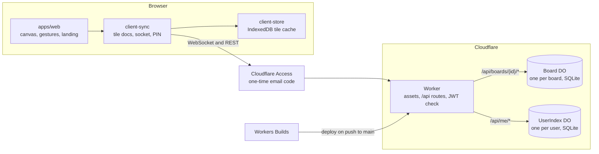
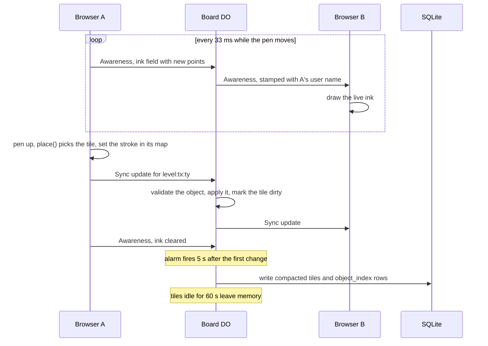
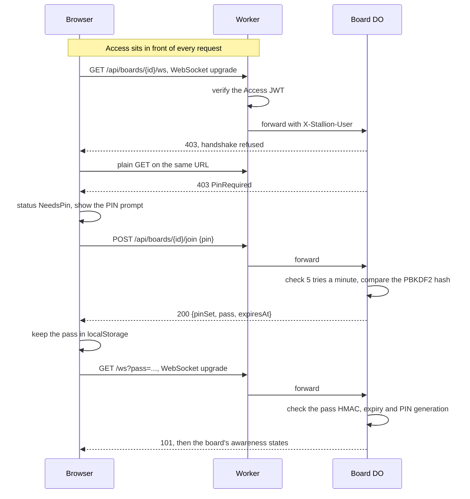
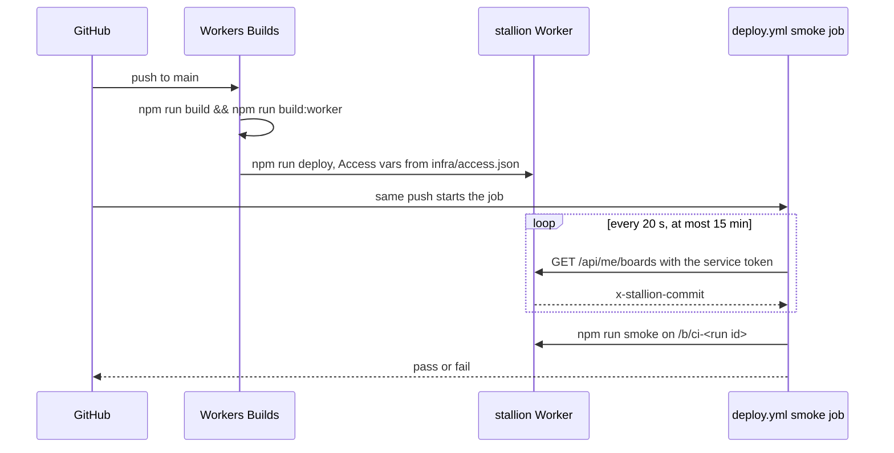

# Architecture

Stallion is one Cloudflare Worker that serves a Preact app and a sync server. `AGENTS.md` holds the full wire protocol, the routes and the deploy setup. This page is the map.

## The model

The board is one continuous plane in world units. The plane is cut into square tiles at 81 levels, from -40 to 40. A tile at level L is 256 × 2^L world units wide. Its key is `level:tx:ty`.

Each object lives in exactly one tile: the smallest tile that holds its whole bounding box. A small stroke lands in a fine tile and a long one in a coarse tile. `place()` in `packages/geometry` picks it.

An object keeps the zoom it was drawn at. A stroke stores that level as `nativeZoom`, and its line width is set in world units from it. The stroke then grows and shrinks with the plane. When it covers less than one pixel, the client skips it.

Each tile is one Yjs document with one map, `objects`, keyed by object id. Each value is the object as CBOR bytes. Every message on the socket is one CBOR frame `{tileKey, kind, payload}`.

The client sends its viewport as a `View` frame. The server splits it into levels. Tiles 64 px and larger on screen are live: they sync both ways. Finer tiles arrive as read-only snapshots.

## The pieces

The Worker serves the built app as static assets. It runs first only for `/api/*`. There it verifies the Access JWT, then forwards the request to a Durable Object. The `Board` object holds the tile documents, the object index and the PIN. The `UserIndex` object holds one user's list of boards.

## Drawing a stroke

The live stroke never touches storage. Only the finished stroke enters a tile document.

## Joining a locked board

A pass lasts 30 days. Setting a new PIN voids every pass and closes every socket with 4003.

## Deploying

GitHub holds no deploy credentials. The `ci` workflow runs lint, typecheck, tests and both builds on every push and pull request.

## Where to look

| Concern | Path |
| --- | --- |
| Tile maths, placement, view split | `packages/geometry/src/` |
| Object and frame schemas, CBOR codec | `packages/schema/src/` |
| Tile docs, socket, offline queue, PIN join | `packages/client-sync/src/board.ts` |
| Live ink over awareness | `packages/client-sync/src/ink.ts` |
| IndexedDB tile cache | `packages/client-store/src/index.ts` |
| Canvas, tools, gestures | `apps/web/src/surface.ts`, `apps/web/src/input.ts` |
| Router and landing page | `apps/web/src/app.tsx`, `apps/web/src/landing.tsx` |
| Routes, Access check, both Durable Objects | `crates/server/src/lib.rs` |
| Tile sync, view budget, moves | `crates/server/src/board.rs`, `crates/server/src/view.rs` |
| SQLite tables and migrations | `crates/server/src/store.rs` |
| JWT verification | `crates/server/src/auth.rs` |
| PIN hash and pass | `crates/server/src/pin.rs`, `crates/server/src/lock.rs` |
| My boards list | `crates/server/src/me.rs` |
| Access setup | `infra/main.tf` |
| Deploy and smoke | `npm-scripts/deploy.mjs`, `npm-scripts/smoke.mjs`, `.github/workflows/deploy.yml` |

## Limits

- The server sends up to 4096 objects per view, coarse levels first and nearest the centre first. A view spans up to 16384 px a side on screen.
- A stroke holds up to 4096 points. An object that fits no tile, not even at level 40, is not saved.
- The app draws strokes only. The schema defines `Shape` and `Text`, but no tool creates them and the canvas does not render them.
- The select tool moves and deletes a stroke. It cannot resize one.
- Each user's board list keeps the last 200 boards opened, with thumbnails up to 24 KB.
